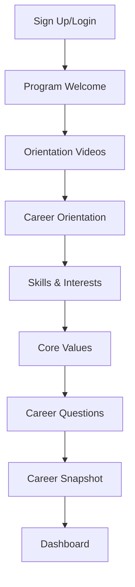

# 📊 Resumen Ejecutivo - Implementación Completa

## ✅ Fases Completadas (3 de 4)

### **Fase 1: Onboarding + Videos + Career Orientation** ✅
**Status**: 100% Completo  
**Archivos**:
- `ProgramWelcome.tsx` - Welcome screen con video y pilares del programa
- `OrientationVideos.tsx` - Secuencia de 3 videos obligatorios
- `CareerOrientation.tsx` - Educación sobre Role vs Industry vs Trajectory

**Flujo Implementado**:
1. Welcome Screen → Video intro + 3 pilares
2. Orientation Videos → 3 videos obligatorios con seguimiento
3. Career Orientation → Contexto educativo

---

### **Fase 2: Skills, Interests & Values** ✅
**Status**: 100% Completo + Database Integration  
**Archivos**:
- `SkillsAndInterests.tsx` - Componente unificado con AI suggestions
- `CoreValues.tsx` - Módulo separado con video educativo
- `CREATE_ONBOARDING_PROFILE_TABLES.sql` - Schema de base de datos

**Base de Datos**:
- ✅ Tabla `user_skills` (normalizada)
- ✅ Tabla `user_interests` (normalizada)
- ✅ Tabla `user_values` (normalizada)
- ✅ Columnas JSONB en `onboarding_responses`

**Features**:
- AI Suggestions toggle
- Intersection detection ("Sweet Spot")
- Validación mínima (3 items c/u)
- Persistencia dual (tablas normalizadas + JSONB)

---

### **Fase 4: Salarios Dinámicos** ✅
**Status**: 100% Completo  
**Archivos**:
- `salaryEstimation.ts` - Servicio de cálculo de salarios
- Actualizado: `Onboarding.tsx` para usar salarios dinámicos

**Features**:
- ✅ 25+ roles con rangos salariales reales
- ✅ Multiplicadores de ubicación (15+ ciudades)
- ✅ Multiplicadores de experiencia (Entry/Mid/Senior)
- ✅ Normalización inteligente de job titles
- ✅ Sugerencias basadas en skills

**Ejemplos**:
- Data Analyst en San Francisco: $81k - $148k (1.35x premium)
- Software Engineer en Austin: $88k - $176k (1.10x premium)
- Business Analyst Remote: $60k - $105k (base)

---

## ⏳ Fase Pendiente (1 de 4)

### **Fase 3: Resume Module (Reestructurado)**
**Status**: No iniciado (0%)  
**Prioridad**: Alta

**Componentes Requeridos**:

1. **Resume Import**
   - Subir archivo .docx
   - Parse automático (roles, fechas, logros)
   - Extracción de skills

2. **Resume Versioning**
   - Guardar múltiples versiones
   - Etiquetas: "Marketing Role", "Tech Role", etc.
   - Comparación de versiones

3. **Renombrar y Reubicar**
   - "JD Analyzer" → "Taylor Resume Tool"
   - Integrar dentro del flujo de resume (no feature aislado)

4. **Bullets Generator (IA)**
   - Generar bullets de accomplishments con IA
   - Usuario: selecciona, edita, reutiliza
   - Biblioteca de bullets guardados

5. **Áreas de Excelencia**
   - Generadas automáticamente desde resume
   - Actualizables manualmente

---

## 📈 Progreso General

| Fase | Componentes | Status | Completado |
|------|-------------|--------|------------|
| Fase 1: Onboarding | 3/3 | ✅ | 100% |
| Fase 2: Profile Data | 4/4 | ✅ | 100% |
| Fase 3: Resume | 0/5 | ⏳ | 0% |
| Fase 4: Salarios | 1/1 | ✅ | 100% |
| **TOTAL** | **8/13** | - | **62%** |

---

## 🗂️ Estructura de Archivos Creados

```
carreerstips/
├── frontend/src/
│   ├── components/onboarding/
│   │   ├── ProgramWelcome.tsx ✅
│   │   ├── OrientationVideos.tsx ✅
│   │   ├── CareerOrientation.tsx ✅
│   │   ├── SkillsAndInterests.tsx ✅
│   │   ├── CoreValues.tsx ✅
│   │   └── (otros componentes existentes)
│   ├── services/
│   │   └── salaryEstimation.ts ✅
│   └── pages/onboarding/
│       └── Onboarding.tsx (actualizado) ✅
│
├── CREATE_ONBOARDING_PROFILE_TABLES.sql ✅
├── VERIFY_ONBOARDING_DATA.sql ✅
├── QUICK_RESET.sql ✅
├── DELETE_USER.sql ✅
├── PHASE_2_IMPLEMENTATION.md ✅
└── PHASE_4_DYNAMIC_SALARIES.md ✅
```

---

## 🎯 Flujo de Usuario Completo (Actual)



**Tiempo estimado**: 15-20 minutos

---

## 💾 Datos Guardados en Base de Datos

Por usuario, se almacena:

1. **user_skills** (normalizado)
   - skill_name, source, timestamps

2. **user_interests** (normalizado)
   - interest_name, source, timestamps

3. **user_values** (normalizado)
   - value_id, value_label, reasoning, timestamps

4. **onboarding_responses** (completo)
   - Todos los campos + JSONB arrays de skills/interests/values

5. **user_profiles**
   - target_job_title, location, onboarding_completed

---

## 🔍 Verificación de Calidad

**Test realizado con user_id**: `02c3711e-0da5-4077-8687-ae0892884ef9`

```json
{
  "Total Skills": 7,
  "Total Interests": 10,
  "Total Values": 4,
  "Onboarding Completado": 1
}
```

✅ **Todos los datos se guardaron correctamente**

---

## 🚀 Próximos Pasos Sugeridos

### Opción A: Continuar con Fase 3 (Resume Module)
- Implementar las 5 funcionalidades descritas
- Tiempo estimado: 3-4 horas de desarrollo

### Opción B: Optimizaciones y Refinamientos
- Mejorar UX de componentes existentes
- Agregar animaciones y transiciones
- Testing en diferentes navegadores

### Opción C: Deployment y Testing
- Hacer deploy de los cambios actuales
- Testing end-to-end con usuarios reales
- Ajustes basados en feedback

---

**Fecha**: 2026-01-17  
**Versión**: v2.0 - Phases 1, 2, 4 Complete  
**Siguiente**: Phase 3 - Resume Module
